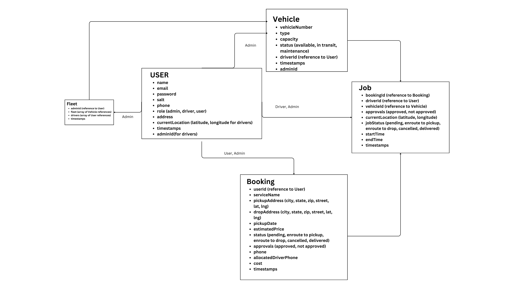

# Submission for my Atlan SE Internship task

Hello thanks for the opportunity

Here is the documentation for the approach: [docs](https://docs.google.com/document/d/1x_qpzDAx2TsGIY48e0aTuDUWLIgOCHZ1wgrCjT_6cFs/edit?usp=sharing)

Architecture Diagram: [drive](https://drive.google.com/file/d/1jfwg5vqDsZVnUb5eNoo-kMD3PWbcNeLV/view?usp=drive_link)

Entity Relationship Diagram: [drive](https://drive.google.com/file/d/1voLavMWAgLag9vZGR6_U--R5v3gvEhkc/view?usp=drive_link)

here is the drive link for all the diagrams and video: [drive](https://drive.google.com/drive/folders/1lb0Ct8DNJ12C69knk2kD4NYjoNRbLOX4?usp=sharing)

